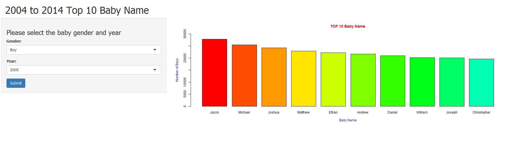

How to pick the right baby name ?
========================================

It is a different topic for expecting parents to find the right name for their baby. This applet displays the top 10 baby name from 2004 to 2014. Therefore, expecting parents can easily know if they want to pick a popular name for their baby or they want to avoid these name for their baby. 


----
Data
================================
The data was collected from Official Social Security website https://www.ssa.gov/OACT/babynames/index.html


```r
Boys<-read.csv("./data/bbabyname.csv")
Girls<-read.csv("./data/gbaby.csv")

head(Boys)
```

```
##   Gender Year Rank    Name Value
## 1    Boy 2004    1   Jacob 27871
## 2    Boy 2004    2 Michael 25438
## 3    Boy 2004    3  Joshua 24183
## 4    Boy 2004    4 Matthew 22868
## 5    Boy 2004    5   Ethan 22203
## 6    Boy 2004    6  Andrew 21694
```

---
How to use this App
============================

This applet has two dropdown box. First is the gender dropdown box and second is the year dropdown box. The applet would base on the selected gender and year display the result with a bar chart. 




---
About
========================
This applet was made for Coursera's Developing Data Products.  

It was weitten in R and hosted by shiny apps at https://jawy.shinyapps.io/shinyapp


